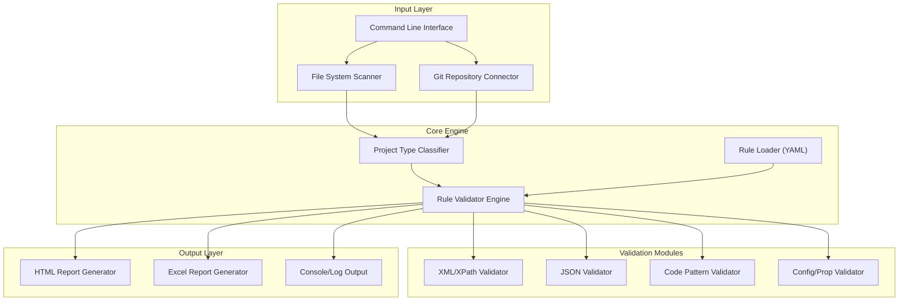

# Enterprise Onboarding Guide
## Aegis - Universal Static Analysis Tool

**Version:** 1.0.0
**Last Updated:** January 2026

---

## Executive Summary

**Aegis** is a comprehensive, extensible static analysis tool designed to enforce coding standards, security best practices, and operational readiness across diverse technology stacks (MuleSoft, Java, TIBCO, Python, etc.). It uses a powerful rule engine to validate configuration consistency, coding patterns, and security vulnerabilities, generating detailed compliance reports. This document provides technical details for enterprise security review, deployment, and onboarding.

---

## 1. Technology Stack

### 1.1 Core Technologies

| Component | Technology | Version | Purpose |
|-----------|-----------|---------|---------|
| **Runtime** | Java (JDK) | 17+ | Application runtime environment |
| **Build Tool** | Apache Maven | 3.x | Dependency management and build automation |
| **Packaging** | Maven Assembly/Shade | - | Creates self-contained executable JAR |
| **Language** | Java | 17 | Primary programming language |

### 1.2 Core Dependencies

All dependencies are from trusted, widely-used open-source projects:

#### Analysis & Parsing
- **DOM4J** `2.1.4` - XML parsing and XPath validation
- **Jackson** `2.15.2` - JSON processing and data binding
- **SnakeYAML** `2.0` - YAML configuration parsing
- **Apache Commons IO** `2.13.0` - File and stream manipulation
- **Apache Commons Text** `1.10.0` - String algorithms and manipulation

#### Reporting
- **Apache POI** `5.2.3` - Excel (.xlsx) report generation
- **Freemarker** (or internal HTML gen) - HTML report generation

#### Logging & CLI
- **SLF4J/Logback** `2.0.7` - Enterprise logging framework
- **Picocli** `4.7.4` - Command line interface parsing

---

## 2. Architecture & Design

### 2.1 Application Architecture



### 2.2 Key Components

| Component | Responsibility |
|-----------|---------------|
| `AegisMain.java` | Main entry point, orchestrates the scan process |
| `RuleEngine.java` | Loads rules and executes validations based on project type |
| `ProjectTypeClassifier.java` | Identifies if a project is CODE or CONFIG to filter rules |
| `Check.java` | Abstract base class for all validation logic |
| `ReportGenerator.java` | Aggregates results and produces HTML/Excel artifacts |

---

## 3. Security Analysis

### 3.1 Dependency Security Status

| Dependency | Security Status | Notes |
|------------|----------------|-------|
| **DOM4J 2.1.4** | ✅ Secure | Latest secure version |
| **Jackson 2.15.2** | ✅ Secure | Standard JSON library |
| **SnakeYAML 2.0** | ✅ Secure | Patched against recent vulnerabilities |
| **Apache POI 5.2.3** | ✅ Secure | Maintained enterprise standard |

### 3.2 Security Features

#### Operational Security
- **Local Execution**: All analysis happens locally on the execution machine.
- **Read-Only**: The tool only reads source files; it does not modify project code.
- **No Exfiltration**: No data is transmitted to external servers or cloud services.

#### Input Validation
- **Path Sanitization**: Validates input paths to prevent directory traversal.
- **Safe Parsing**: XML parsers configured to prevent XXE attacks.

---

## 4. Packaging & Distribution

### 4.1 Build Process

```bash
mvn clean package
```
**Output:** `target/aegis-1.0.0-jar-with-raks.jar`

### 4.2 System Requirements
- **Java**: JDK 17+
- **Memory**: 512MB Minimum, 1GB+ Recommended for large repositories

---

## 5. Deployment Models

### 5.1 Command Line Interface (CLI)
Run as a standard Java application:
```bash
# Standard Scan
java -jar aegis.jar -p /path/to/projects

# Provide Custom Rules
java -jar aegis.jar -p /path/to/projects --config /path/to/custom-rules.yaml
```

### 5.2 Graphical User Interface (GUI)
Aegis includes a built-in web-based GUI for interactive analysis:
```bash
# Start GUI on default port 8080
java -jar aegis.jar --gui

# Start GUI on custom port
java -jar aegis.jar --gui --port 9000
```

### 5.3 Shell Scripts (Recommended)
Convenience scripts are provided for both Windows and Mac:
- **Windows**: `start-aegis-gui.bat`
- **Mac/Linux**: `./start-aegis-gui.sh`

### 5.4 Wrapper Integration
Aegis is integrated into the **ApiGuard Wrapper** as a core library, allowing it to run within a MuleSoft runtime environment and be accessible via a Web Portal and REST API.

---

## 6. Compliance & Governance

### 6.1 License Compliance
- **Apache 2.0**: Maven, Jackson, Commons, POI, SnakeYAML
- **BSD**: DOM4J
- **MIT**: SLF4J

All libraries are permissive and compatible with enterprise commercial use.

### 6.2 Data Handling
- **Transient**: No permanent storage of scanned code.
- **Reports**: Generated reports contain file paths and rule violation summaries but do not reproduce full source code.

---

## 7. Configuration & Support

### 7.1 Configuration
Configuration is managed via `src/main/resources/rules/rules.yaml`.
- **Global Settings**: File extensions, excluded folders.
- **Rule Definitions**: The actual validation logic.
- **Project Types**: Definitions for `CODE` vs `CONFIG` detection.

### 7.2 Support
See contact details below.

---
**For any further inquiries, reach out to:**

- **Author**: Rakesh Kumar
- **Email**: Rakesh.Kumar@ibm.com
- **Role**: Application Architect
---


---

## 8. Standards & Best Practices

### 8.1 Rule Development
When creating new rules in `rules.yaml`, follow these standards:

- **Targeting**: Use the `appliesTo` field to target specific project types (`CODE` or `CONFIG`).
  ```yaml
  - id: "RULE-001"
    name: "My Checked Rule"
    appliesTo: ["CODE"]  # Only runs on source code projects
  ```
- **Message Format**: Use the standardized multi-line message format:
  ```yaml
  successMessage: "✓ [Short Summary]\nFiles Checked: {CHECKED_FILES}\nItems Found: {FOUND_ITEMS}\nItems Matched: {MATCHING_FILES}\nDetails: {DEFAULT_MESSAGE}\n{PROPERTY_RESOLVED}"
  ```
- **Tokens**: Always include `{CHECKED_FILES}`, `{FOUND_ITEMS}`, and `{MATCHING_FILES}`.
