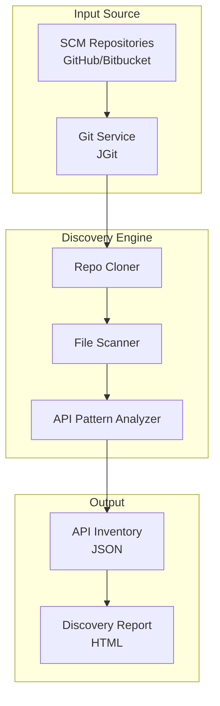

# Enterprise Onboarding Guide
## ApiDiscovery - Automated API Inventory Tool

**Version:** 1.0.0  
**Last Updated:** January 2026

---

## Executive Summary

ApiDiscovery is an automated tool designed to scan source code repositories (Git) to identify, catalog, and analyze API endpoints (REST/Mule implementation). It generates a centralized inventory of APIs, helping organizations detect undocumented "shadow APIs" and maintain an up-to-date service catalog.

---

## 1. Technology Stack

### 1.1 Core Technologies

| Component | Technology | Version | Purpose |
|-----------|-----------|---------|---------|
| **Runtime** | Java (JDK) | 17+ | Application runtime environment |
| **Build Tool** | Apache Maven | 3.x | Dependency management |
| **Packaging** | Maven Assembly Plugin | 3.6.0 | Creates executable JAR |
| **Language** | Java | 17 | Primary programming language |

### 1.2 Core Dependencies

| Dependency | Version | Purpose |
|------------|---------|---------|
| **JGit** | 7.5.0 | Cloning and analyzing Git repositories |
| **Gson** | 2.10.1 | JSON inventory generation |
| **SnakeYAML** | 2.2 | YAML parsing (modern Mule app flows) |
| **Maven Model** | 3.9.6 | Project metadata analysis |

---

## 2. Architecture & Design

### 2.1 Application Architecture



### 2.2 Key Components

| Component | Responsibility |
|-----------|---------------|
| `ApiDiscoveryTool.java` | Main entry point |
| `GitService.java` | Handles cloning/checking out repositories |
| `DiscoveryEngine.java` | Orchestrates scanning of downloaded files |
| `MuleParser.java` | Parses Mule XML to extract HTTP Listeners |

---

## 3. Security Analysis

### 3.1 Dependency Security Status

| Dependency | Security Status | Notes |
|------------|----------------|-------|
| **JGit 7.5.0** | ✅ Secure | Supports secure SSH/HTTPS transport |
| **Gson 2.10.1** | ✅ Secure | No known serialization vulnerabilities |
| **SnakeYAML 2.2** | ✅ Secure | Safe constructor defaults |

### 3.2 Security Features

#### Repo Access
- **Ephemeral Cloning**: Repositories are cloned to a temporary directory (`java.io.tmpdir`) and deleted immediately after analysis.
- **Credential Handling**: Supports standard git credentials (files or environment) without logging them.

### 3.3 Security Considerations

| Risk Area | Mitigation |
|-----------|-----------|
| **Network Access** | Tool requires outbound HTTPS (443) or SSH (22) access to Source Control Management (SCM) systems. |
| **Large Repos** | Cloning massive monorepos may consume significant disk space/bandwidth. Use `--depth 1` (shallow clone). |

---

## 4. Packaging & Distribution

### 4.1 Build Process

```bash
mvn clean package
```
**Output:** `target/apidiscovery-1.0.0-with-raks.jar`

### 4.2 System Requirements
- **Java**: JDK 17+
- **Network**: Connectivity to Git Repositories
- **Disk**: Enough temporary space to hold the largest repository being scanned.

---

## 5. Deployment Models

### 5.1 CLI Execution
Run as an ad-hoc scanner:
```bash
java -jar apidiscovery.jar --repo https://github.com/myorg/repo.git
```

### 5.2 Scheduled Cron Job
Run nightly to update the enterprise API catalog:
```bash
# Example Cron Entry
0 2 * * * java -jar apidiscovery.jar --list repos.txt --output /var/www/catalog.json
```

---

## 6. Compliance & Governance

### 6.1 License Compliance
- **EPL (Eclipse Public License)**: JGit
- **Apache 2.0**: Gson, Maven Model, SnakeYAML

All licenses are permissive and compatible with enterprise usage.

### 6.2 Data Privacy
- **Source Code**: Read-only access. Code is never modified or pushed back.
- **Inventory Data**: The generated inventory contains only metadata (URLs, Methods), not implementation details or business logic.

---

## 7. Support

- **Repository**: Managed internally.
- **Updates**: Rebuild periodically to update JGit/parser patterns.

---
**For any further inquiries, reach out to:**

- **Author**: Rakesh Kumar
- **Email**: Rakesh.Kumar@ibm.com
- **Role**: Application Architect
---

