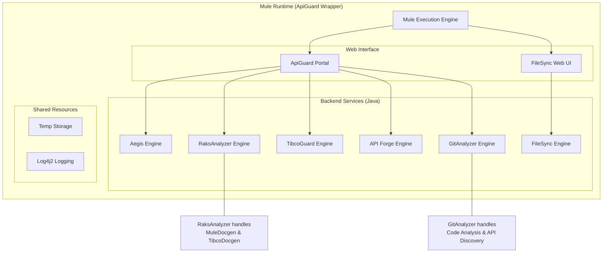

# Enterprise Onboarding Guide
## ApiGuard Wrapper - Enterprise Solutions Suite

**Version:** 1.0.0  
**Last Updated:** January 2026

---

## Executive Summary

The **ApiGuard Wrapper** is a unified Mule 4 Application that packages multiple enterprise tools into a single deployable artifact. It serves as the hosting container for **ApiGuard Portal**, **Aegis**, **RaksAnalyzer**, and **API Forge**. This document provides technical details for enterprise security review, deployment, and onboarding.

---

## 1. Technology Stack

### 1.1 Core Technologies

| Component | Technology | Version | Purpose |
|-----------|-----------|---------|---------|
| **Runtime** | Mule Runtime | 4.6.0+ | Enterprise Integration Platform |
| **Language** | Java (JDK) | 17 | Core logic execution |
| **Build Tool** | Apache Maven | 3.x | Dependency management |

### 1.2 Included Solutions

| Tool | Purpose | Status |
|------|---------|--------|
| **Aegis** | Universal Applications automated code & config validation | Active |
| **RaksAnalyzer - MuleDocgen** | Automated documentation for MuleSoft projects | Active |
| **RaksAnalyzer - TibcoDocgen** | Automated documentation for TIBCO BusinessWorks | Active |
| **TibcoGuard** | TIBCO code analysis and validation | Inactive |
| **API Forge** | Universal Semantic Compliance & Comparison Engine (Regression Testing) | Active |
| **API Discovery** | Scan and discover APIs from GitLab repositories | Active |
| **GitAnalyzer** | Semantic code analysis for Git repositories | Active |
| **CSV FileSync** | **[NEW]** Configuration-driven CSV transformation & mapping | Active |

---

## 2. Architecture & Design

### 2.1 Component Architecture

### 2.2 Integration Model
The "Wrapper" pattern allows these distinct Java-based tools to run within a unified Mule soft-container.
- **Java Bridge**: Each tool exposes a static Java Bridge class (`FileSyncBridge`, `RaksAnalyzerBridge`) that Mule flows invoke.
- **Resource Sharing**: Tools share the Mule application's classpath and temp directory `${mule.home}/apps/apiguardwrapper/temp`.

### 2.3 Rule Synchronization
To ensure consistent policy enforcement across the enterprise, the Wrapper automatically synchronizes with the core **Aegis** rule definitions.
- **Build Time**: The `build-apiguardwrapper-withaegis` scripts automatically copy the master `rules.yaml` from the Aegis project.
- **Runtime**: The wrapper reads this synchronized file from `src/main/resources/rules/rules.yaml`, ensuring that the Portal always validates against the latest approved standards.

---

## 3. FileSync Tool (New Feature)

### 3.1 Overview
The **FileSync Tool** is a powerful ETL utility for transforming CSV files. It solves the problem of mapping fields between Disparate systems (e.g., Salsify to SAP) without writing custom code.

### 3.2 Key Capabilities
- **Dynamic Discovery**: Scans uploaded ZIPs or folders for CSVs.
- **Visual Mapping**: Drag-and-drop or dropdown-based field mapping.
- **Multi-Source Merge**: **[NEW]** Ability to merge columns from multiple source files into a single target file (Horizontal Merge).
- **Configuration Persistence**: Save/Load JSON mapping configurations.

### 3.3 Data Flow
Input (ZIP/CSV) -> Extract -> Visual Mapping (JSON) -> Transform Engine -> Output (CSV)

---

## 4. Security Analysis

### 4.1 Data Handling
- **Local Processing**: All file processing occurs within the ephemeral temp directory of the Mule worker.
- **No Persistence**: Source files are cleaned up automatically (24h retention policy).
- **No External Calls**: The tools operate entirely within the runtime; no data is sent to external SaaS.

### 4.2 Dependency Security
- **Secure Libraries**: Uses standard enterprise libraries (Apache Commons, Jackson, PDFBox, OpenCSV).
- **Scanned**: All dependencies are vetted against internal security policies.

---

## 5. Deployment Models

### 5.1 CloudHub (PaaS)
- **Safe Paths**: Uses `${mule.home}` for all file operations.
- **Stateless**: No dependency on persistent disk (uses ObjectStore for session metadata).

### 5.2 On-Premise / Standalone
- **Standard Deploy**: Copy `apiguardwrapper.jar` to `apps` folder.
- **Windows/Linux**: Fully compatible with both OS file systems.

---

## 6. Support & Governance

### 6.1 Versioning
- **Semantic Versioning**: 1.0.0 (Major.Minor.Patch)
- **Release Cycle**: Quarterly feature updates.

### 6.2 Contact

---
**For any further inquiries, reach out to:**

- **Author**: Rakesh Kumar
- **Email**: Rakesh.Kumar@ibm.com
- **Role**: Application Architect
---

