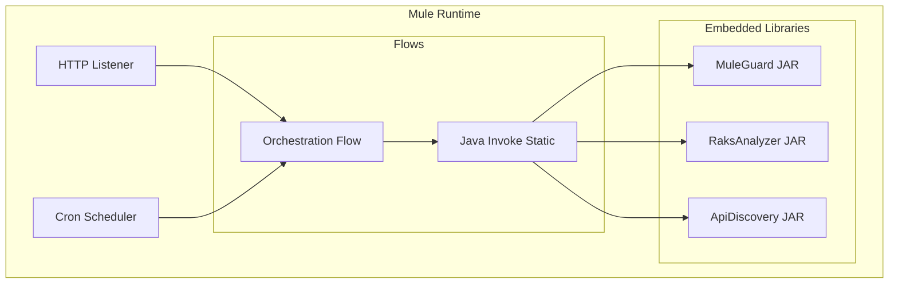

# Enterprise Onboarding Guide
## ApiGuardWrapper - MuleSoft Integration Wrapper

**Version:** 1.0.0  
**Last Updated:** January 2026

---

## Executive Summary

ApiGuardWrapper is a specialized MuleSoft Application acting as an orchestration layer and release vehicle for the APITestingGuard suite (`raksanalyzer`, `muleguard`, `apidiscovery`). It exposes these Java-based tools via Mule flows, allowing them to be triggered via HTTP APIs, scheduled events, or integrated into broader Anypoint Platform workflows.

---

## 1. Technology Stack

### 1.1 Core Technologies

| Component | Technology | Version | Purpose |
|-----------|-----------|---------|---------|
| **Runtime** | Mule Runtime | 4.9.1 | MuleSoft execution engine |
| **Language** | DataWeave / XML | 2.0 | Integration logic |
| **Packaging** | Mule Application | .jar | Deployable Mule artifact |
| **JDK** | Java | 17 | Underlying JVM |

### 1.2 Core Dependencies

| Dependency | Version | Purpose |
|------------|---------|---------|
| **Spring Framework** | 5.3.39 | Service bean management (Patched for CVEs) |
| **Mule HTTP Connector** | 1.10.3 | Exposes REST APIs |
| **Mule Email Connector** | 1.7.3 | Sends reports via email |
| **Mule Guard** | 1.0.0 | Embedded analysis library |
| **Raks Analyzer** | 1.0.0 | Embedded doc gen library |

---

## 2. Architecture & Design

### 2.1 Application Architecture



### 2.2 Key Flows

| Flow Name | Responsibility |
|-----------|---------------|
| `api-guard-main` | Main entry point for API requests |
| `scheduler-flow` | Triggers nightly scans |
| `report-distribution` | Emails generated reports to stakeholders |

---

## 3. Security Analysis

### 3.1 Dependency Security Status

| Dependency | Security Status | Notes |
|------------|----------------|-------|
| **Spring 5.3.39** | ✅ Secure | Critical upgrade from 5.3.x baseline |
| **Commons Text** | ✅ Secure | Patched against Text4Shell |

### 3.2 Security Features

#### MuleSoft Security
- **Secure Properties**: Uses `mule-secure-configuration-property-module` to encrypt sensitive config (passwords, tokens).
- **HTTPS**: HTTP Listeners configured for TLS.

### 3.3 Security Considerations

| Risk Area | Mitigation |
|-----------|-----------|
| **Java Invocation** | The wrapper invokes static Java methods. Ensure input to these methods is sanitized in DataWeave. |
| **File Access** | Mule App requires IO permissions to read project files and write reports. |

---

## 4. Packaging & Distribution

### 4.1 Build Process

```bash
mvn clean package
```
**Output:** `target/apiguardwrapper-1.0.0-mule-application.jar`

### 4.2 System Requirements
- **Runtime**: Mule Runtime 4.4+ (Standard or Enterprise)
- **Cores**: 0.1 vCore minimum
- **Memory**: 512MB Metaspace (due to embedded heavy JARs)

---

## 5. Deployment Models

### 5.1 CloudHub / Runtime Fabric
Deploy as a standard Mule Application:
1.  Upload JAR to Runtime Manager.
2.  Set properties (`secure.key`, etc.).
3.  Start application.

### 5.2 On-Premise / Hybrid
Deploy to `$MULE_HOME/apps`.

---

## 6. Compliance & Governance

### 6.1 License Compliance
- **Commercial**: MuleSoft Connectors (Requires valid subscription for Enterprise connectors).
- **Open Source**: Wrapped libraries are Apache 2.0.

### 6.2 Data Privacy
Wrapper does not persist data. It acts as a passthrough to the underlying analysis tools.

---

## 7. Support

- **MuleSoft Support**: For runtime issues.
- **Internal Support**: For wrapper logic and embedded tool issues.
