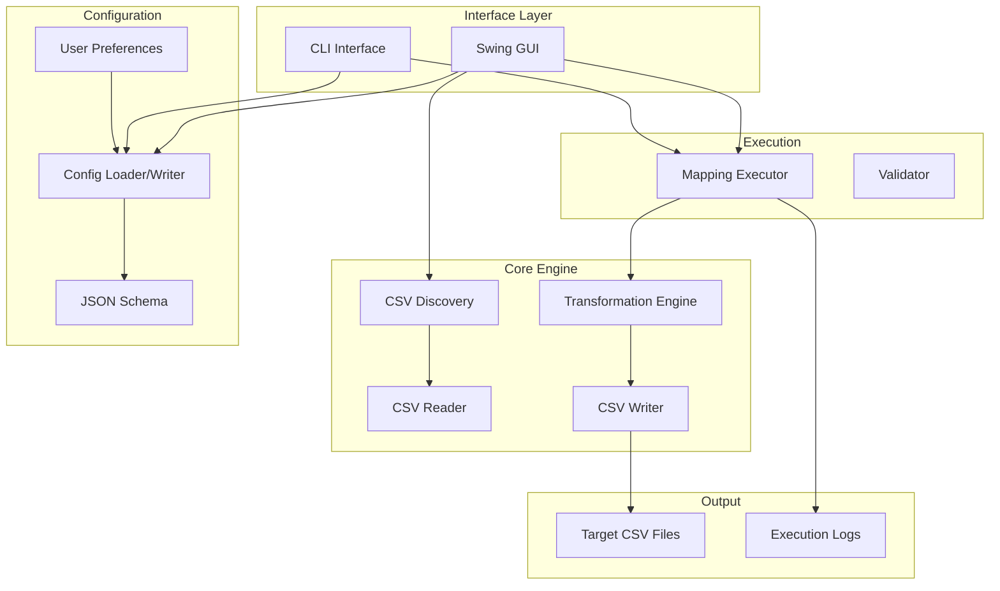

# Enterprise Onboarding Guide
## FileSync Tool - CSV Transformation Framework

**Version:** 1.0.0  
**Last Updated:** January 2026

---

## Executive Summary

FileSync is a configuration-driven CSV transformation tool designed to handle hundreds of different source files with unknown layouts. It provides both GUI and CLI interfaces for creating field-level mappings between source and target CSV files, with session persistence and automated workflow features. This document provides technical details for enterprise security review, deployment, and onboarding.

---

## 1. Technology Stack

### 1.1 Core Technologies

| Component | Technology | Version | Purpose |
|-----------|-----------|---------|---------|
| **Runtime** | Java (JDK) | 17+ | Application runtime environment |
| **Build Tool** | Apache Maven | 3.x | Dependency management and build automation |
| **Packaging** | Maven Shade Plugin | 3.5.1 | Creates self-contained executable JAR (uber-jar) |
| **Language** | Java | 17 | Primary programming language |

### 1.2 Core Dependencies

All dependencies are from trusted, widely-used open-source projects:

#### CSV Processing
- **OpenCSV** `5.9` - CSV parsing and writing
- **Apache Commons Text** `1.11.0` - Text manipulation utilities
- **Apache Commons IO** `2.15.1` - File I/O utilities

#### JSON Configuration
- **Gson** `2.10.1` - JSON serialization/deserialization for configuration files

#### CLI Interface
- **Apache Commons CLI** `1.6.0` - Command-line argument parsing

#### Logging
- **SLF4J** `2.0.9` - Logging facade
- **SLF4J Simple** `2.0.9` - Simple logging implementation

#### GUI Framework
- **Java Swing** (Built-in) - Desktop GUI framework
- **Java AWT** (Built-in) - Graphics and windowing

---

## 2. Architecture & Design

### 2.1 Application Architecture



### 2.2 Key Components

| Component | Responsibility |
|-----------|---------------|
| `FileSyncTool.java` | Main entry point, mode selection (GUI/CLI) |
| `MainWindow.java` | GUI main window with tabbed interface |
| `DiscoveryPanel.java` | Source directory scanning and file discovery |
| `MappingPanel.java` | Visual field mapping builder |
| `ExecutePanel.java` | Transformation execution and logging |
| `CsvDiscovery.java` | Scans directories and extracts CSV schemas |
| `MappingExecutor.java` | Core transformation execution engine |
| `ConfigLoader.java` / `ConfigWriter.java` | JSON configuration management |
| `UserPreferences.java` | Session persistence using Java Preferences API |

---

## 3. Security Analysis

### 3.1 Dependency Security Status

| Dependency | Security Status | Notes |
|------------|----------------|-------|
| **OpenCSV 5.9** | ✅ Secure | Latest stable release, active maintenance |
| **Gson 2.10.1** | ✅ Secure | Google-maintained, widely adopted |
| **Commons CLI 1.6.0** | ✅ Secure | Apache Foundation project |
| **Commons Text 1.11.0** | ✅ Secure | Latest version, active maintenance |
| **SLF4J 2.0.9** | ✅ Secure | Standard logging facade |

### 3.2 Security Features

#### Operational Security
- **Local Execution**: All file processing happens locally on the user's machine.
- **No Network Calls**: Does not transmit data to external services.
- **File System Only**: Reads source CSVs, writes target CSVs to specified directories.
- **Session Isolation**: User preferences stored in OS-specific secure storage (Windows Registry, macOS Preferences, Linux ~/.java).

#### Input Validation
- **Path Sanitization**: Validates file paths to prevent traversal attacks.
- **CSV Validation**: Validates CSV structure before processing.
- **Configuration Validation**: JSON schema validation for configuration files.

### 3.3 Security Considerations

| Risk Area | Mitigation |
|-----------|-----------|
| **File System Access** | Application requires read access to source directories and write access to target directories. Run with appropriate file permissions. |
| **Configuration Files** | JSON configuration files may contain directory paths. Store securely if paths contain sensitive information. |
| **Memory Usage** | Large CSV files may require increased heap size (-Xmx). Default is 256MB-512MB. |
| **Session Data** | User preferences (last used directories) stored in OS preference store. No sensitive data stored. |

---

## 4. Packaging & Distribution

### 4.1 Build Process

```bash
mvn clean package
```
**Output:** `target/filesync-1.0.0.jar` (3.2 MB)

### 4.2 System Requirements
- **Java**: JDK 17+
- **Memory**: 256MB Minimum, 1GB+ Recommended for medium files, 4GB+ for large files
- **Disk Space**: 50MB for application, additional space for CSV files
- **OS**: Windows, macOS, Linux (any OS supporting Java 17+)

---

## 5. Deployment Models

### 5.1 Desktop Application (GUI Mode)
Run as a desktop application:
```bash
java -jar filesync-1.0.0.jar
```
GUI launches automatically with tabbed interface (Discovery, Mapping, Execute, Help).

### 5.2 Command-Line Tool (CLI Mode)
Use for automation and scripting:

**Discover CSV files:**
```bash
java -jar filesync-1.0.0.jar -m discover -s /path/to/source
```

**Execute transformation:**
```bash
java -jar filesync-1.0.0.jar -m execute -c /path/to/config.json
```

**Validate configuration:**
```bash
java -jar filesync-1.0.0.jar -m validate -c /path/to/config.json
```

### 5.3 Large File Processing
For processing large CSV files (10,000+ rows):
```bash
# 4GB heap for large files
java -Xmx4g -jar filesync-1.0.0.jar

# 8GB heap for very large files
java -Xms2g -Xmx8g -jar filesync-1.0.0.jar
```

---

## 6. Compliance & Governance

### 6.1 License Compliance
- **Apache 2.0**: OpenCSV, Commons CLI, Commons Text, Commons IO, Gson
- **MIT**: SLF4J

All libraries are permissive and compatible with enterprise use.

### 6.2 Data Handling
- **Read-Only Source**: The tool reads source CSV files without modification.
- **Local Processing**: All transformations happen locally, no cloud services.
- **Configurable Output**: Target files written to user-specified directories.
- **No Data Transmission**: No data is sent to external services or APIs.

### 6.3 Privacy
- **Session Persistence**: Last used directories and window positions stored in OS preference store.
- **No Telemetry**: No usage data collected or transmitted.
- **No Authentication**: Standalone tool, no user accounts or credentials.

---

## 7. Configuration & Support

### 7.1 Configuration

#### JSON Configuration Schema
Configuration files define source-to-target mappings:
```json
{
  "version": "1.0",
  "paths": {
    "sourceDirectory": "C:/data/source",
    "targetDirectory": "C:/data/target"
  },
  "fileMappings": [
    {
      "sourceFile": "source.csv",
      "targetFile": "target.csv",
      "fieldMappings": [
        {
          "sourceField": "CustomerID",
          "targetField": "customer_id",
          "transformation": "direct"
        }
      ]
    }
  ]
}
```

#### User Preferences (Automatic)
Stored in OS-specific locations:
- **Windows**: `HKEY_CURRENT_USER\Software\JavaSoft\Prefs\com\raks\filesync\gui`
- **macOS**: `~/Library/Preferences/com.raks.filesync.gui.plist`
- **Linux**: `~/.java/.userPrefs/com/raks/filesync/gui/prefs.xml`

### 7.2 Features

#### Session Persistence
- Last used source directory
- Last used target directory
- Last used configuration file
- Window size and position

#### Auto-Load Configuration
- Automatically loads mappings from Mapping tab when switching to Execute tab
- Seamless workflow without manual save/load steps

#### Enhanced Logging
- Timestamped execution logs
- Full file paths in output
- Structured success/warning/error reporting

### 7.3 Support
- **Documentation**: README.md and built-in Help & Guide tab
- **Issues**: Report via internal git repository
- **Updates**: Standard Maven dependency updates

---

## 8. Performance Characteristics

### 8.1 Processing Capacity

| File Size | Rows | Recommended Heap | Processing Time (Est.) |
|-----------|------|------------------|----------------------|
| Small | <1,000 | Default (256MB) | <1 second |
| Medium | 1,000-10,000 | 2GB | 1-5 seconds |
| Large | 10,000-100,000 | 4GB | 5-30 seconds |
| Very Large | 100,000+ | 8GB+ | 30+ seconds |

### 8.2 Scalability
- **Concurrent Files**: Processes files sequentially for data integrity
- **Memory Footprint**: Scales with file size, configurable via JVM heap
- **Disk I/O**: Optimized with buffered readers/writers

---

## 9. Operational Considerations

### 9.1 Monitoring
- **Execution Logs**: Real-time logging in GUI, console output in CLI
- **Progress Indicators**: Visual progress bar in GUI mode
- **Error Reporting**: Detailed error messages with file/field context

### 9.2 Backup & Recovery
- **Configuration Backup**: JSON configuration files can be version controlled
- **Source Preservation**: Source files are never modified
- **Idempotent Execution**: Re-running with same config produces same output

### 9.3 Troubleshooting

| Issue | Solution |
|-------|----------|
| **OutOfMemoryError** | Increase heap size with `-Xmx` flag |
| **File Not Found** | Verify source directory paths in configuration |
| **CSV Parse Error** | Check CSV format (UTF-8 encoding, proper delimiters) |
| **Permission Denied** | Ensure read/write permissions on source/target directories |

---

## 10. Integration Patterns

### 10.1 Batch Processing
Integrate into scheduled jobs:
```bash
# Cron job example (Linux/macOS)
0 2 * * * java -Xmx2g -jar /opt/filesync/filesync-1.0.0.jar -m execute -c /etc/filesync/daily-transform.json
```

### 10.2 CI/CD Pipeline
Use in build pipelines for data transformation:
```yaml
# Example GitLab CI
transform-data:
  script:
    - java -jar filesync-1.0.0.jar -m execute -c config/transform.json
```

### 10.3 Pre/Post Processing
- **Pre-processing**: Validate CSV files before transformation
- **Post-processing**: Archive or move processed files

---

## 11. Version History

| Version | Date | Changes |
|---------|------|---------|
| 1.0.0 | January 2026 | Initial release with GUI/CLI, session persistence, auto-load |

---

## 12. Contact & Resources

- **Repository**: Internal Git repository
- **Documentation**: README.md, ENTERPRISE_ONBOARDING.md
- **Built-in Help**: Help & Guide tab in GUI (5 comprehensive sections)

---

**© 2018 RAKS ApiGuard FileSync - Enterprise API Solution Suite**
