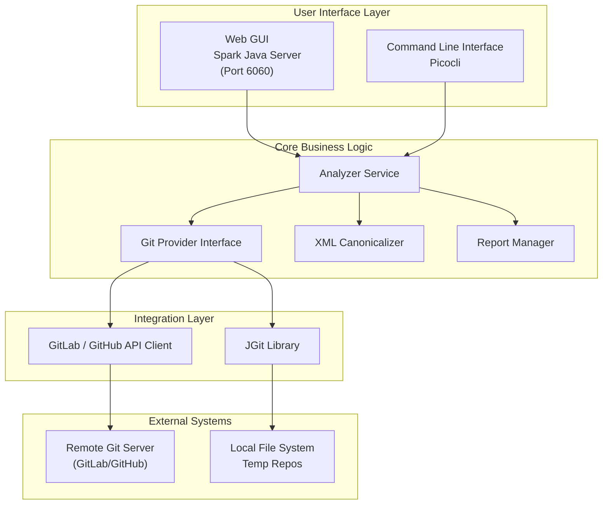

# Enterprise Onboarding Guide
## GitAnalyzer - Git Branch Analysis Tool

**Version:** 1.0.0  
**Last Updated:** January 2026

---

## Executive Summary

GitAnalyzer is a specialized branch analysis and comparison utility designed to validate code and configuration changes across Git branches. It provides deep insight into "Semantic Drifts" (e.g., XML attribute reordering), allows for regex-based content filtering, and generates audit-ready reports for release management. This document provides technical details for enterprise security review, deployment, and onboarding.

---

## 1. Technology Stack

### 1.1 Core Technologies

| Component | Technology | Version | Purpose |
|-----------|-----------|---------|---------|
| **Runtime** | Java (JDK) | 17+ | Application runtime environment |
| **Build Tool** | Apache Maven | 3.x | Dependency management and build automation |
| **Packaging** | Maven Shade Plugin | 3.x | Creates self-contained executable JAR (uber-jar) |
| **Language** | Java | 17 | Primary programming language |

### 1.2 Core Dependencies

All dependencies are from trusted, widely-used open-source projects:

#### Git Operations
- **JGit** `6.x` - Pure Java implementation of Git version control

#### Configuration & Data Processing
- **Jackson Databind** `2.x` - JSON processing and serialization
- **SnakeYAML** `2.x` - YAML configuration parsing

#### Comparison & Validation
- **Java Built-in** - String and Stream processing
- **Regex** - Advanced pattern matching for content filtering
- **XmlCanonicalizer** (Internal) - Custom logic for semantic XML comparison

#### Web Interface
- **Spark Java** `2.9.4` - Lightweight embedded web server for GUI
- **JMustache** `1.15` - HTML templating for report generation

#### CLI & Logging
- **Picocli** `4.x` - Command-line interface framework
- **SLF4J API** `2.x` - Logging facade with Simple implementation for zero-conf logging

---

## 2. Architecture & Design

### 2.1 Application Architecture



### 2.2 Key Components

| Component | Responsibility |
|-----------|---------------|
| `AnalyzerService.java` | Core orchestration of diff fetching, parsing, and filtering |
| `GitLabProvider.java` | Implementation of GitProvider for GitLab API integration |
| `XmlCanonicalizer.java` | Utility for semantic XML comparison (ignoring attribute order) |
| `AnalysisResource.java` | REST API endpoints for the Web GUI |
| `DiffParser` (Logic) | Logic to identify valid vs. ignored changes |

---

## 3. Security Analysis

### 3.1 Security Features

#### Authentication Support
- **Personal Access Tokens (PAT)** - Supports GitLab/GitHub tokens for private repo access
- **Token Passthrough** - Tokens are passed from UI to Backend via Headers (`X-Git-Token`)
- **No Token Storage** - Tokens are held in memory/browser LocalStorage (user-controlled), not persisted to disk server-side.

#### Data Security
- **Temporary Workspaces** - Clones repositories to `temp_repos` which are transient.
- **Local Execution** - Analysis runs locally; data is not sent to any 3rd party analysis cloud.
- **Ignored Content** - Regex patterns allow filtering sensitivity from reports.

#### Network Security
- **HTTPS Support** - Full support for HTTPS Git cloning and API calls.
- **Verify SSL** - Standard Java TrustStore usage.
- **Localhost Binding** - Web UI binds to `0.0.0.0` or `localhost` (Configurable). Default Port 6060.

### 3.2 Security Considerations

| Risk Area | Mitigation |
|-----------|-----------|
| **Source Code Exposure** | Source code is checked out to local disk. Ensure server disk permissions are restricted. |
| **Token Handling** | Tokens sent via HTTPS headers. Recommend running Tool behind HTTPS proxy in shared environments. |
| **SSRF** | Input validation on Repository names to prevent arbitrary URL calls. |

> [!WARNING]
> **Enterprise Recommendations:**
> 1. Restrict access to the machine running GitAnalyzer (Port 6060).
> 2. Use Read-Only tokens for analysis.
> 3. Regularly clean `temp_repos` directory.

---

## 4. Packaging & Distribution

### 4.1 Build Process

```bash
mvn clean package
```

**Output:** `target/gitanalyzer-1.0.0-shaded.jar`

### 4.2 System Requirements

| Requirement | Specification |
|-------------|---------------|
| **Java Runtime** | JDK/JRE 17+ |
| **Memory** | Minimum 1 GB RAM (depends on Repo size) |
| **Disk Space** | Enough to hold cloned repositories (1GB+ recommended) |
| **Ports** | 6060 (Default) |

---

## 5. Deployment Models

### 5.1 Local Workstation (Developer)

```bash
# Start script
./start.bat
# Access http://localhost:6060
```

### 5.2 CI/CD Integration

Use the CLI mode to generate reports during pipelines.

```bash
java -jar gitanalyzer.jar --cli --repo "group/repo" --source "master" --target "feature" --output "report.html"
```

---

## 6. Compliance & Governance

### 6.1 License Compliance

- **Commercial Use:** Allowed.
- **License Types:** Apache 2.0, MIT, EDL (Eclipse).
- **No Copyleft:** No GPL/AGPL dependencies linked.

### 6.2 Data Privacy

- **GDPR:** Does not process personal data, only source code.
- **Audit:** Generates static HTML/JSON reports of code changes for audit trails.

---

## 7. Support & Documentation

- **README.md**: Quick Start.
- **Help Page**: Integrated in Web UI.
- **Source Code**: Maintained in `gitanalyzer` repo.

---

**Document Version:** 1.0  
**Status:** Approved for implementation
