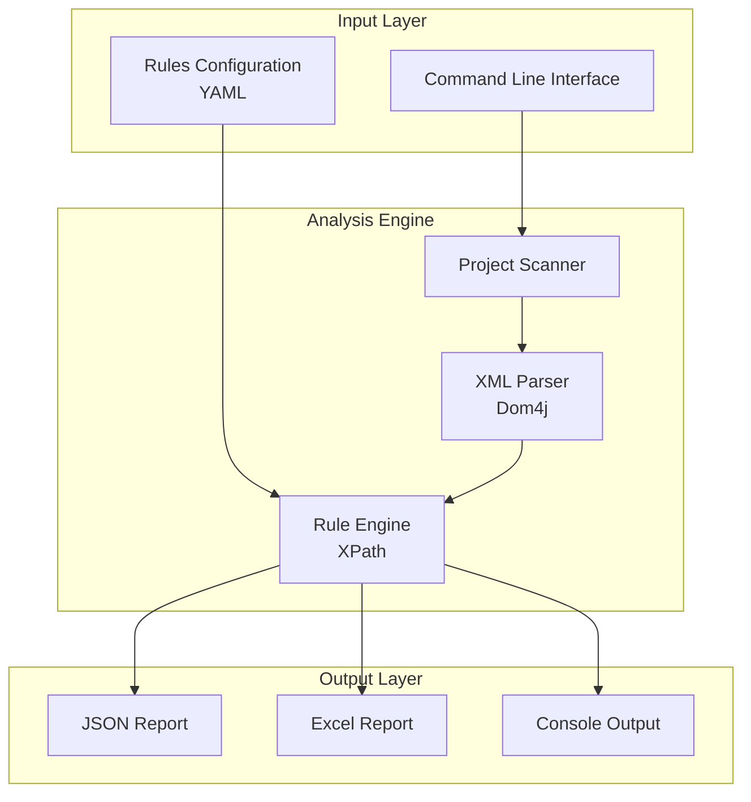

# Enterprise Onboarding Guide
## MuleGuard - MuleSoft Code Quality & Security Scanner

**Version:** 1.0.0  
**Last Updated:** January 2026

---

## Executive Summary

MuleGuard is a specialized static analysis tool for MuleSoft applications. It scans Mule XML configuration files to enforce coding standards, security best practices, and enterprise governance policies. It generates detailed reports on policy violations and code quality metrics.

---

## 1. Technology Stack

### 1.1 Core Technologies

| Component | Technology | Version | Purpose |
|-----------|-----------|---------|---------|
| **Runtime** | Java (JDK) | 17+ | Application runtime environment |
| **Build Tool** | Apache Maven | 3.x | Dependeny management |
| **Packaging** | Maven Assembly Plugin | 3.6.0 | Creates executable JAR |
| **Language** | Java | 17 | Primary programming language |

### 1.2 Core Dependencies

| Dependency | Version | Purpose |
|------------|---------|---------|
| **Dom4j** | 2.1.4 | XML parsing and XPath evaluation |
| **Jaxen** | 2.0.0 | XPath engine for Dom4j |
| **Jackson** | 2.18.2 | JSON output generation |
| **Apache POI** | 5.4.0 | Excel report generation |
| **Picocli** | 4.7.5 | Command-line interface |
| **SnakeYAML** | 2.2 | Configuration parsing |
| **SLF4J** | 2.0.9 | Logging API |
| **Logback** | 1.4.11 | Logging implementation |
| **Maven Model** | 3.9.6 | Parsing `pom.xml` files |

---

## 2. Architecture & Design

### 2.1 Application Architecture



### 2.2 Key Components

| Component | Responsibility |
|-----------|---------------|
| `MuleGuardMain.java` | CLI entry point and orchestration |
| `MuleXmlChecker.java` | Core logic for XML parsing and rule validation |
| `ReportGenerator.java` | Generates JSON/Excel reports |
| `RuleLoader.java` | Loads governance rules from YAML |

---

## 3. Security Analysis

### 3.1 Dependency Security Status

| Dependency | Security Status | Notes |
|------------|----------------|-------|
| **SLF4J/Logback** | ✅ Secure | Industry-standard logging framework |
| **Dom4j 2.1.4** | ✅ Secure | Modern maintenance fork of dom4j |
| **SnakeYAML 2.2** | ✅ Secure | Safe constructor defaults |
| **Apache POI 5.4.0** | ✅ Secure | Latest version |

### 3.2 Input Modes

MuleGuard supports multiple input methods:

| Mode | Availability | Description |
|------|--------------|-------------|
| **Local Folder** | Standalone CLI/GUI | Scan projects from filesystem |
| **ZIP Upload** | Standalone GUI, Wrapper | Upload and validate ZIP archives |
| **JAR Upload** | Standalone GUI, Wrapper | Validate Mule application JAR files |
| **Git Repository** | ✅ Available | Clone and validate from GitLab/GitHub repositories |

### 3.3 Configuration File Requirements

**Important**: Environment-specific configuration files must follow this structure:
- **Folder Name**: Must contain `_config` in the name (e.g., `muleapp_config`, `api_config`, `myproject_config`)
- **File Extensions**: `.properties`, `.policy`, or `.deployment`
- **File Format**: `propertyName=propertyValue` (delimiter must be `=`)

Example:
```
your-mule-projects/
├── api-project-1/
├── api-project-2/
└── muleapp_config/
    ├── dev.properties
    ├── qa.properties
    └── prod.properties
```

**Note**: The default pattern in `rules.yaml` is `".*_config.*"` which matches any folder containing `_config`. You can modify this pattern if needed.

### 3.4 Security Features

#### Static Analysis
- **Offline Scanning**: MuleGuard does not execute the Mule code it scans. It purely performs static text/XML analysis.
- **Safe XPath**: Uses Jaxen/Dom4j for read-only XPath evaluation.

#### Data Privacy
- **No Uploads**: Code is scanned locally. No metadata acts as telemetry.

### 3.3 Security Considerations

| Risk Area | Mitigation |
|-----------|-----------|
| **Rule Configuration** | Ensure custom XPath rules (in YAML) are reviewed to prevent inefficient queries (DoS). |
| **File Access** | Tool requires read access to project directories. Run with appropriate OS permissions. |

### 3.5 Workflow Isolation & CloudHub Compatibility

MuleGuard implements **Workflow Isolation** to ensure safe operation in multi-user and cloud environments:

- **Unique Run IDs**: Every validation run (Local, ZIP, JAR, Git) uses a unique `runId` based on a high-precision timestamp.
- **Isolated Workspaces**: Working directories are nested under `${app.home}/temp` using a `sessionID_runId` structure. This prevents directory collisions on Windows and data leakage between concurrent user sessions.
- **CloudHub Deployment**: Designed to run on MuleSoft CloudHub. Temporary artifacts are stored in the memory-backed `${app.home}/temp` directory, ensuring ephemeral data is cleared upon worker restart.

---

## 4. Packaging & Distribution

### 4.1 Build Process

```bash
mvn clean package
```
**Output:** `target/muleguard-1.0.0-jar-with-raks.jar`

### 4.2 System Requirements
- **Java**: JDK 17+
- **Disk Space**: Minimal (< 50MB)
- **Input**: Valid MuleSoft application (Maven project structure)

---

## 5. Deployment Models

### 5.1 CLI Execution
Run directly on developer workstations or build servers. The CLI supports robust argument parsing and custom configurations:

```bash
# Basic usage
java -jar muleguard.jar -p /path/to/mule/project

# With custom rules (multiple flag aliases supported)
java -jar muleguard.jar -p /path/to/project --config /path/to/custom-rules.yaml
java -jar muleguard.jar -p /path/to/project -c /path/to/custom-rules.yaml
```

### 5.2 CI/CD Pipeline
Integrate into Jenkins/GitLab CI/Azure DevOps:
1.  Checkout code.
2.  Run MuleGuard against the workspace.
3.  Fail build if critical violations > 0.
4.  Archive generated reports.

---

## 6. Compliance & Governance

### 6.1 License Compliance
- **Apache 2.0**: Default license for most dependencies (Log4j, Maven, Picocli, POI).
- **BSD-Style**: Dom4j/Jaxen.
- **MIT**: SLF4J/Commons.

All licenses are enterprise-compliant.

### 6.2 Governance Rules
MuleGuard enforces governance via `rules.yaml`. Categories include:
- **Naming Conventions**: Check flow/variable names.
- **Security**: Detect hardcoded passwords, dangerous components (`<scripting:component>`).
- **Best Practices**: Ensure error handling, logging, and retry strategies.

---

## 7. Support

- **Issue Tracking**: Internal JIRA/GitHub Issues.
- **Rule Updates**: Rules are externalized in YAML. Users can provide custom rules via CLI (`--config`), UI file uploads, or persistent paths in **Settings**.
