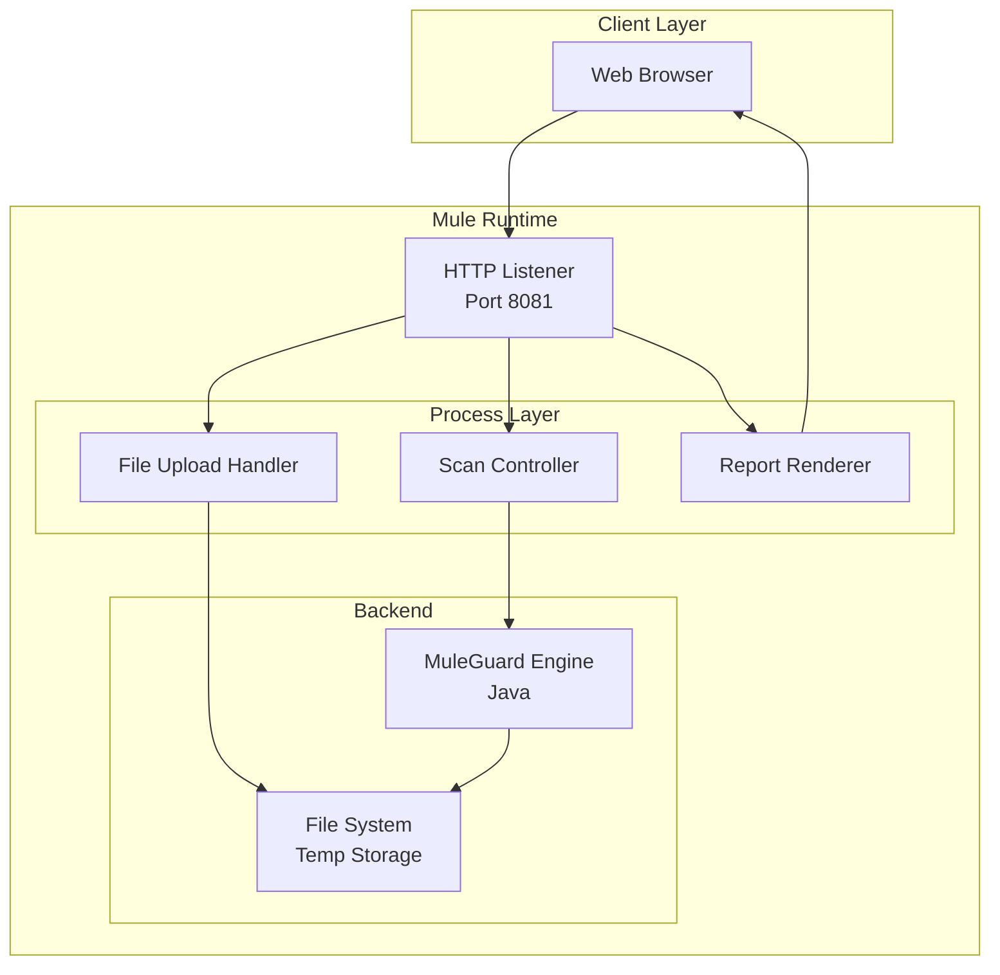

# Enterprise Onboarding Guide
## MuleGuardWrapper - Web GUI for MuleSoft Governance

**Version:** 1.0.0  
**Last Updated:** January 2026

---

## Executive Summary

MuleGuardWrapper is a MuleSoft Application that provides a user-friendly Web GUI for the MuleGuard scanning engine. It allows users to upload Mule projects (as ZIPs) or point to repositories, run governance scans, and view interactve HTML/PDF reports directly in the browser. It democratizes access to the MuleGuard CLI for non-technical stakeholders.

---

## 1. Technology Stack

### 1.1 Core Technologies

| Component | Technology | Version | Purpose |
|-----------|-----------|---------|---------|
| **Runtime** | Mule Runtime | 4.9.1 | MuleSoft execution engine |
| **Language** | DataWeave / XML | 2.0 | Integration logic |
| **GUI** | HTML/JS | N/A | Embedded frontend |
| **Packaging** | Mule Application | .jar | Deployable artifact |

### 1.2 Core Dependencies

| Dependency | Version | Purpose |
|------------|---------|---------|
| **MuleGuard** | 1.0.0 | Embedded scanning engine |
| **Mule HTTP Connector** | 1.10.3 | Web server for GUI |
| **Mule Email Connector** | 1.7.3 | Email notifications of scan results |
| **Jsoup** | 1.17.2 | HTML processing/sanitization |
| **Spring Framework** | 5.3.39 | Service bean management |

---

## 2. Architecture & Design

### 2.1 Application Architecture



### 2.2 Key Flows

| Flow Name | Responsibility |
|-----------|---------------|
| `gui-main` | Serves the static HTML/CSS/JS assets |
| `scan-trigger` | Receives uploaded ZIPs and initiates MuleGuard scan |
| `report-download` | Serves generated Excel/JSON reports |

---

## 3. Security Analysis

### 3.1 Dependency Security Status

| Dependency | Security Status | Notes |
|------------|----------------|-------|
| **Mule Runtime 4.9.1** | ✅ Secure | Latest patch release |
| **Spring 5.3.39** | ✅ Secure | Patched against critical CVEs |
| **Jsoup 1.17.2** | ✅ Secure | Defense against XSS in report rendering |

### 3.2 Security Features

#### Input Validation
- **File Uploads**: Validates ZIP file headers (magic numbers) to prevent malicious uploads.
- **Path Traversal Protection**: Sanitizes filenames extracted from archives.

#### Output Encoding
- **HTML Reports**: Uses DataWeave and Jsoup to encode output, preventing Cross-Site Scripting (XSS).

### 3.3 Security Considerations

| Risk Area | Mitigation |
|-----------|-----------|
| **DoS (Uploads)** | Limit max file size in HTTP Listener configuration (default 50MB). |
| **Temp Storage** | Uploaded files are stored in `java.io.tmpdir`. Ensure OS cron jobs clean this directory periodically. |

---

## 4. Packaging & Distribution

### 4.1 Build Process

```bash
mvn clean package
```
**Output:** `target/muleguardwrapper-1.0.0-mule-application.jar`

### 4.2 System Requirements
- **Runtime**: Mule Runtime 4.4+
- **Resources**: 0.2 vCore (minimum) due to file processing overhead

---

## 5. Deployment Models

### 5.1 CloudHub
Deploy as a standard Mule Application via Runtime Manager. Ensure `workers` have sufficient disk space for temporary file processing.

### 5.2 On-Premise
Copy JAR to `apps` directory. Configure `http.port` in `wrapper.conf` or properties file if 8081 is taken.

---

## 6. Compliance & Governance

### 6.1 License Compliance
- **MuleSoft**: Requires appropriate subscription/license for production use.
- **Components**: All bundled libraries are Apache 2.0 compatible.

### 6.2 Data Privacy
- **Retention**: Transient storage only. Files are deleted after configured TTL (default 1 hour).
- **Access**: No authentication by default (Intranet tool). Enable Mule Policy (Basic Auth/OAuth) for production access.

---

## 7. Support

- **MuleSoft Support**: Platform issues.
- **Internal Team**: App logic and rule definitions.
