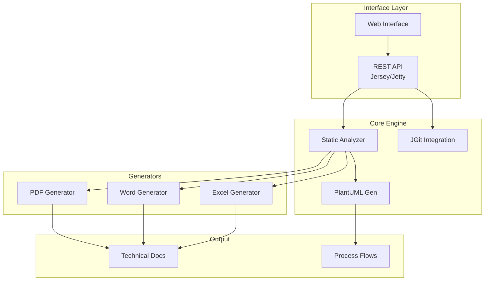

# Enterprise Onboarding Guide
## RaksAnalyzer - Universal Document Generation Framework

**Version:** 1.0.0  
**Last Updated:** January 2026

---

## Executive Summary

RaksAnalyzer is a universal document generation framework designed to analyze project structures (MuleSoft, TIBCO, etc.) and generate comprehensive technical documentation in PDF, Word, and Excel formats. This document provides technical details for enterprise security review, deployment, and onboarding.

---

## 1. Technology Stack

### 1.1 Core Technologies

| Component | Technology | Version | Purpose |
|-----------|-----------|---------|---------|
| **Runtime** | Java (JDK) | 17+ | Application runtime environment |
| **Build Tool** | Apache Maven | 3.x | Dependency management and build automation |
| **Packaging** | Maven Shade Plugin | 3.5.1 | Creates self-contained executable JAR (uber-jar) |
| **Language** | Java | 17 | Primary programming language |

### 1.2 Core Dependencies

All dependencies are from trusted, widely-used open-source projects:

#### Web/API Server
- **Eclipse Jetty** `11.0.24` - Embedded HTTP server
- **Jersey (JAX-RS)** `3.1.5` - RESTful API implementation
- **Jackson** `2.16.1` - JSON processing

#### Document Generation
- **Apache PDFBox** `3.0.1` - PDF creation and manipulation
- **Apache POI** `5.4.0` - Microsoft Word (.docx) and Excel (.xlsx) generation
- **EasyTable** `1.0.2` - Table creation for PDFBox

#### Analysis & Utilities
- **JGit** `7.5.0` - Git repository operations
- **PlantUML** `1.2025.10` - Diagram generation (Flow/Sequence)
- **SnakeYAML** `2.2` - YAML configuration parsing
- **SLF4J/Logback** - Logging framework

---

## 2. Architecture & Design

### 2.1 Application Architecture



### 2.2 Key Components

| Component | Responsibility |
|-----------|---------------|
| `Application.java` | Main entry point, server initialization |
| `AnalyzerResource.java` | REST endpoints for triggering analysis |
| `ProjectAnalyzer.java` | Core logic for parsing project structures |
| `PdfGenerator.java` | Orchestrates PDF document creation |
| `WordGenerator.java` | Orchestrates Word document creation |
| `TibcoDiagramGenerator.java` | Generates diagrams for TIBCO projects |

---

## 3. Security Analysis

### 3.1 Dependency Security Status

| Dependency | Security Status | Notes |
|------------|----------------|-------|
| **Jetty 11.0.24** | ✅ Secure | Latest stable Jakarta EE 9+ release |
| **Jersey 3.1.5** | ✅ Secure | Standard JAX-RS implementation |
| **Apache POI 5.4.0** | ✅ Secure | Latest version, active maintenance |
| **PDFBox 3.0.1** | ✅ Secure | Latest major version |
| **JGit 7.5.0** | ✅ Secure | Eclipse foundation project |

### 3.2 Security Features

#### Operational Security
- **Local Execution**: file analysis happens locally or via cloned repositories.
- **Ephemeral Storage**: Cloned repositories are stored in temporary directories.
- **No External Calls**: Does not transmit code to 3rd party analysis services.

#### Input Validation
- **Path Sanitization**: Validates file paths to prevent traversal attacks.
- **Git Safety**: JGit handles secure git protocols (HTTPS/SSH).

### 3.3 Security Considerations

| Risk Area | Mitigation |
|-----------|-----------|
| **Source Code Access** | Application requires read access to repositories. Run with least-privilege service account. |
| **Generated Artifacts** | Output documents may contain architectural details. Store securely. |
| **Memory Usage** | Large projects may require increased heap size (-Xmx). |

---

## 4. Packaging & Distribution

### 4.1 Build Process

```bash
mvn clean package
```
**Output:** `target/raksanalyzer-1.0.0.jar`

### 4.2 System Requirements
- **Java**: JDK 17+
- **Memory**: 1GB Minimum, 2GB+ Recommended for large projects
- **Graphviz**: Required for PlantUML diagram generation

---

## 5. Deployment Models

### 5.1 Standalone Service
Run as a background Java process:
```bash
java -jar raksanalyzer-1.0.0.jar
```
Access UI at `http://localhost:8080` (or configured port).

### 5.2 CI/CD Integration
Can be invoked as part of a build pipeline to auto-generate documentation on commit.

---

## 6. Compliance & Governance

### 6.1 License Compliance
- **Apache 2.0**: Jetty, PDFBox, POI, OpenCSV, Commons IO
- **EPL**: JGit
- **MIT**: SLF4J
- **LGPL/GPL**: PlantUML (Dual licensed, compatible for use)

All libraries are permissive or weak-copyleft compatible with enterprise use.

### 6.2 Data Handling
- **Read-Only**: The tool primarily reads source code.
- **Local Processing**: No code is sent to cloud analysis tools.

---

## 7. Configuration & Support

### 7.1 Configuration
Configuration is managed via `framework.properties`:
- `server.port`: HTTP port (default 8080)
- `output.directory`: Location for generated files
- `logging.level`: Log verbosity

### 7.2 Support

---
**For any further inquiries, reach out to:**

- **Author**: Rakesh Kumar
- **Email**: Rakesh.Kumar@ibm.com
- **Role**: Application Architect
---

